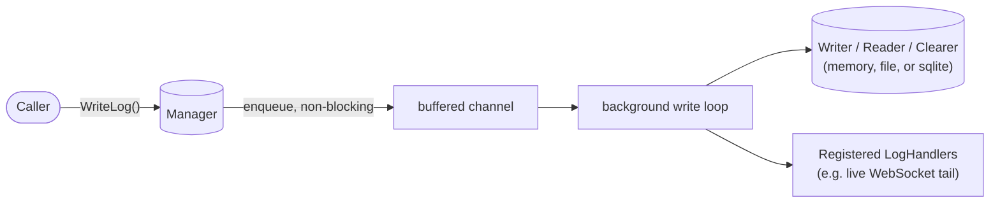
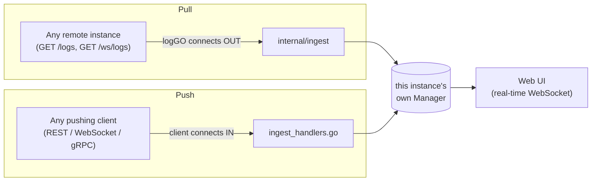

# logGO

## What is it

Two things, in one module:

1. A small logging **library** (`go get github.com/ttfancy/logGO`):
   dependency-injected, asynchronous writes, pluggable storage, level
   filtering.
2. A standalone log-**aggregator service** (`cmd/server`) built on top
   of it, Dozzle-style: pull logs from any number of remote instances,
   or have any number of clients push logs straight to it over REST,
   WebSocket, or gRPC, all shown together, live, in one UI.

It has no code relationship with any specific project. Anything that
exposes `GET /logs` + `GET /ws/logs` can be pulled from, and anything
can push to it over any of the three protocols above.

## How to build

```bash
# As a library
go get github.com/ttfancy/logGO
```

```go
store := memory.New() // or file.Open("app.log"), or sqlite.Open("app.db")
manager := logGO.NewManager(store, store, store)
defer manager.Close()

manager.RegisterLogHandler(logGO.LogHandlerFunc(func(e logGO.LogEntry) {
    fmt.Printf("[%s] %s\n", e.Level(), e.Message())
}))

manager.WriteLog("INFO", "server started", logGO.F("port", 8080))
entries, _ := manager.ReadLogs("ERROR", logGO.LogFilter{})
```

See `example_test.go` for a runnable version (`go doc -all .` shows it
as `Example`).

The standalone server:

**Docker, server only:**

```bash
docker build -t loggo . && docker run -p 9090:9090 loggo
```

**Docker Compose, server plus the three demo push-clients** (see "How
it works" below):

```bash
docker compose up --build
```

**Go binary:**

```bash
go run ./cmd/server
```

**Build binaries directly** (server and the three demo clients):

```bash
go build -o loggo-server ./cmd/server
go build -o demo-rest ./cmd/demo-rest-client
go build -o demo-ws ./cmd/demo-ws-client
go build -o demo-grpc ./cmd/demo-grpc-client
```

Open http://localhost:9090 (override the port with `PORT`) and click
**+ Add service**. No env vars required to get started.

## How it works



`Manager` is built from three small interfaces (`LogWriter`,
`LogReader`, `LogClearer`, usually one backend implementing all
three, but a backend that only appends+reads isn't forced to support
pruning), plus `LogHandler`, the extension point that both the
standalone server's live UI and the WebSocket log tail are built on.
`WriteLog` never blocks on I/O: it just enqueues and returns.

The standalone server adds two independent ways logs get in:



Each registered source is one of two kinds, picked in the UI's "+ Add
service" form (or `kind` in `POST /sources`):

| Kind | What happens | Registered via |
|---|---|---|
| **pull** | logGO connects out: backfills `GET /logs`, then live-tails `GET /ws/logs`, reconnecting with backoff | `{"name","base_url","api_key"}` |
| **push** | logGO connects nowhere; a client sends entries to it | `{"name","kind":"push","protocol":"rest"\|"websocket"\|"grpc"}` |

Registering a push source is a convenience (a friendly name plus a
generated connection snippet), never enforced. An unregistered source
still works, tagged under whatever raw string it sends.

Push protocols, concretely (`localhost:9090`):

```bash
curl -X POST http://localhost:9090/ingest \
  -H 'Content-Type: application/json' \
  -d '{"source":"my-service","level":"INFO","message":"hello"}'

wscat -c ws://localhost:9090/ws/ingest
> {"source":"my-service","level":"INFO","message":"hello"}

grpcurl -plaintext -d '{"source":"my-service","entry":{"level":"INFO","message":"hello"}}' \
  localhost:9090 ingest.v1.IngestService/Ingest
```

`cmd/demo-rest-client`, `cmd/demo-ws-client`, and `cmd/demo-grpc-client`
are one working example of each, on a timer; `docker compose up` runs
all three against a containerized server at once.

A couple of design choices worth knowing:

- **Entries are plain values, not pooled.** An earlier design pooled
  them via `sync.Pool`; that's unsafe once entries fan out to an
  arbitrary number of `LogHandler`s that might retain the pointer past
  their `Handle` call. The actual low-GC requirement is met where the
  real allocation hot spot is instead: the `file` backend pools
  `*bytes.Buffer` for JSON encoding, which has no such aliasing risk.
- **`WriteEntry` preserves an entry's original timestamp**; `WriteLog`
  stamps `time.Now()`. Every pulled or pushed entry uses `WriteEntry`,
  since an aggregator using ingestion time instead of when something
  actually happened would misrepresent its own data.

Full diagrams (core structure, write/read sequences, server components,
pull and push ingestion sequences) are in
[`docs/diagrams/`](docs/diagrams/): PlantUML, view with
[plantuml.com](https://plantuml.com) or an editor extension.

## How to test

```bash
go test ./... -race
```

Covers level filtering, `WriteEntry`'s timestamp preservation, a
genuine concurrency test (many goroutines writing + registering
handlers at once, under `-race`), `ClearLogs` boundary semantics, the
`DropNewest` backpressure policy under a stalled writer, round-trips
against both the `file` and `sqlite` backends, and `internal/ingest`
against a fake remote instance (`httptest`): backfill, live tail,
tagging, and reconnect-with-backoff on disconnect.

## Reference

### Configuration

| Env var | Default | Meaning |
|---|---|---|
| `PORT` | `9090` | HTTP listen port |
| `LOG_FILE_PATH` | `logGO.log` | Where this instance's own entries persist |
| `SOURCES_FILE` | `sources.json` | Where registered sources persist |
| `CONTOGETHER_URL` / `CONTOGETHER_API_KEY` | *(none)* | Optional: auto-registers a pull source at boot |
| `SOURCE_NAME` | `conTogether` | Display name for the source above, if set |

### API

| Method | Path | Notes |
|---|---|---|
| GET | `/entries?level=&contains=&source_id=` | Historical query, capped at 500 |
| GET | `/ws/entries` | Backlog then real-time push, what the UI uses |
| GET | `/sources` | List (API keys never included) |
| POST | `/sources` | Add, pull or push, see "How it works" |
| DELETE | `/sources/{id}` | Stop ingesting (history stays) |
| POST | `/ingest` | Push via REST |
| GET | `/ws/ingest` | Push via a persistent WebSocket |
| gRPC | `IngestService/Ingest` | Push via gRPC |

## Known limitations

- The default queue size (1024) and `Block` backpressure policy are
  general defaults, not tuned for any particular throughput. Override
  via `WithQueueSize`/`WithDropPolicy`.
- `sqlite.Store` caps its connection pool at 1 to avoid "database is
  locked" errors, since SQLite serializes writers at the file level
  anyway.
